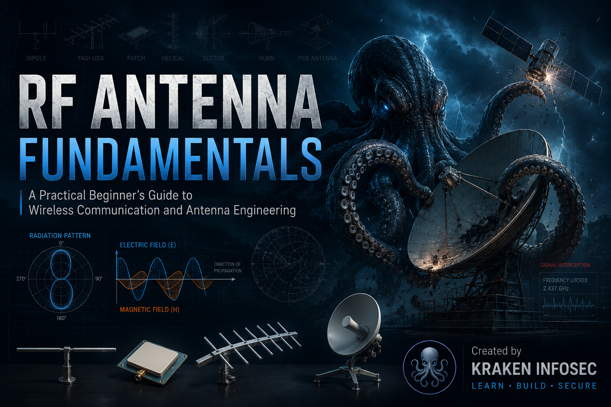

<p align="center">
  
</p>

<h1 align="center">RF Antenna Fundamentals</h1>

<p align="center">
A Practical Beginner's Guide to Wireless Communication and Antenna Engineering
</p>

<p align="center">


</p>

---

## About This Project

RF Antenna Fundamentals is an open-source educational handbook designed to help beginners build a strong understanding of antennas and wireless communication from first principles.

Instead of jumping directly into formulas or datasheets, this guide explains the concepts step by step, showing not only **how antennas work**, but **why they are designed the way they are**.

Throughout the guide, you'll learn how radio waves propagate, how antennas convert electrical energy into electromagnetic waves, why different antenna designs exist, how gain and beamwidth affect coverage, and how complete RF systems are built in real-world applications.

Whether you're working with **Wi-Fi**, **LoRa**, **GPS**, **Bluetooth**, **SDR**, **IoT**, **satellite communication**, or embedded RF hardware, the same engineering principles apply. This guide is written to help you understand those principles in a practical and approachable way.

Unlike many online tutorials that focus on isolated topics, this repository follows a structured learning path—from the absolute fundamentals of RF engineering to practical antenna selection, troubleshooting, and complete wireless system design.

The goal isn't simply to explain antennas.

The goal is to help you think like an RF engineer.

---

# 📖 What You'll Learn

This guide is organized as a complete learning path, starting with the fundamentals of radio frequency (RF) engineering and gradually progressing toward practical antenna design, wireless communication systems, and real-world applications.

By the end of this handbook, you'll understand:

- 📡 How antennas transmit and receive radio waves
- 🌍 The relationship between frequency, wavelength, and antenna size
- 📶 The difference between omnidirectional and directional antennas
- 📈 Radiation patterns, antenna gain (dBi), and beamwidth
- 📐 Quarter-wave, half-wave, and full-wave antenna design
- 🔄 Antenna polarization and cross-polarization loss
- ⚡ Impedance, VSWR, Return Loss, and RF matching
- 🔌 RF connectors, coaxial cables, and feed line losses
- 📡 Modern wireless technologies such as MIMO and antenna diversity
- 🛰️ Common antenna types used in Wi-Fi, LoRa, GPS, SDR, satellite communication, IoT, and embedded systems
- 🛠️ How to choose the right antenna for a specific application
- 🔍 Common RF mistakes and practical troubleshooting techniques
- 📊 How experienced engineers analyze complete wireless communication systems instead of focusing on individual components

Whether you're completely new to RF engineering or looking to strengthen your fundamentals, this guide is designed to help you build practical knowledge that can be applied to real hardware and real projects.

---

---

# 📊 Book Statistics

This repository is being developed as a comprehensive, open-source handbook on RF antennas and wireless communication.

| | |
|:---|:---|
| 📖 Chapters | 20 |
| 📄 Pages | 200+ |
| 📷 Illustrations & Diagrams | 100+ *(In Progress)* |
| 📡 Antenna Types Covered | 18+ |
| 🧮 RF Calculations & Examples | 40+ |
| 📚 Practical Examples | 50+ |
| 🛰️ Wireless Technologies | Wi-Fi, LoRa, Bluetooth, GPS, SDR, Satellite, IoT & More |
| 🎯 Skill Level | Beginner → Intermediate |
| 🌍 License | Open Source (MIT) |

This handbook is designed to bridge the gap between beginner-friendly explanations and practical RF engineering, making complex concepts easier to understand without sacrificing technical accuracy.

---
---

# 📚 Table of Contents

This handbook is divided into three major parts, allowing you to build your understanding step by step—from the fundamentals of RF engineering to practical antenna selection and complete wireless system design.

---

# Part I — RF Fundamentals

Learn the core principles that every RF engineer should understand before choosing or designing an antenna.

| Chapter | Topic |
|----------|-------|
| **Chapter 1** | [Introduction](docs/01-introduction.md) |
| **Chapter 2** | [What Is an Antenna?](docs/02-what-is-an-antenna.md) |
| **Chapter 3** | [Why Do We Need an Antenna?](docs/03-why-do-we-need-an-antenna.md) |
| **Chapter 4** | [Radio Waves, Frequency and Wavelength](docs/04-radio-waves-frequency-and-wavelength.md) |
| **Chapter 5** | [How Does an Antenna Work?](docs/05-how-does-an-antenna-work.md) |
| **Chapter 6** | [Why Do Antennas Have Different Shapes and Sizes?](docs/06-why-do-antennas-have-different-shapes.md) |
| **Chapter 7** | [Omnidirectional vs Directional Antennas](docs/07-omnidirectional-vs-directional.md) |
| **Chapter 8** | [Understanding Radiation Patterns](docs/08-radiation-pattern.md) |
| **Chapter 9** | [Understanding Antenna Gain (dBi)](docs/09-antenna-gain.md) |
| **Chapter 10** | [Understanding Beamwidth](docs/10-beamwidth.md) |
| **Chapter 11** | [Quarter-Wave, Half-Wave and Full-Wave Antennas](docs/11-quarter-half-full-wave.md) |
| **Chapter 12** | [Understanding Antenna Polarization](docs/12-polarization.md) |
| **Chapter 13** | [Understanding Antenna Impedance](docs/13-antenna-impedance.md) |
| **Chapter 14** | [Understanding VSWR and Return Loss](docs/14-vswr-return-loss.md) |
| **Chapter 15** | [RF Connectors and Coaxial Cables](docs/15-rf-connectors-and-coax.md) |
| **Chapter 16** | [Understanding MIMO and Antenna Diversity](docs/16-mimo-and-diversity.md) |

---

# Part II — Antenna Types

Explore the most common antenna designs used in modern wireless communication and understand where each one performs best.

| Chapter | Topic |
|----------|-------|
| **Chapter 17** | [Common Antenna Types](docs/17-common-antenna-types.md) |

> Covers Dipole, Monopole, Rubber Duck, PCB, Chip, Patch, Helical, Yagi-Uda, Log-Periodic, Loop, Horn, Parabolic Dish, Sector, Collinear, Spiral, Discone, Fractal, and Phased Array antennas.

---

# Part III — Practical RF Engineering

Bring everything together by learning how experienced RF engineers select antennas, troubleshoot problems, and build reliable wireless communication systems.

| Chapter | Topic |
|----------|-------|
| **Chapter 18** | [Choosing the Right Antenna](docs/18-choosing-the-right-antenna.md) |
| **Chapter 19** | [Common Antenna Mistakes and How to Avoid Them](docs/19-common-antenna-mistakes.md) |
| **Chapter 20** | [Putting Everything Together](docs/20-putting-everything-together.md) |

---
---

# 🗺️ Learning Roadmap

Whether you're completely new to RF engineering or already experimenting with wireless hardware, this guide is designed to be followed from start to finish. Each chapter builds on the previous one, gradually taking you from the fundamentals of radio waves to complete RF system design.

```text
                 START HERE
                      │
                      ▼
         RF Fundamentals (Chapters 1–6)
                      │
                      ▼
        Antenna Fundamentals (Chapters 7–12)
                      │
                      ▼
      RF System Fundamentals (Chapters 13–16)
                      │
                      ▼
         Common Antenna Types (Chapter 17)
                      │
                      ▼
        Choosing the Right Antenna (Chapter 18)
                      │
                      ▼
     Common Mistakes & Troubleshooting (Chapter 19)
                      │
                      ▼
      Thinking Like an RF Engineer (Chapter 20)
```

By the time you complete the final chapter, you'll understand not only **how antennas work**, but also **how experienced RF engineers analyze, design, and troubleshoot complete wireless communication systems.**

---
## 🚧 Project Status

- ✅ Chapters 1–20 Complete
- 🚧 Technical illustrations in progress
- 🚧 Original antenna diagrams in progress
- 🚧 GitHub Pages documentation in development
- 🚧 PDF edition in preparation
